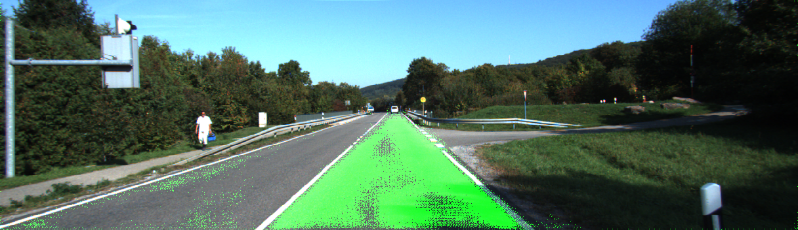
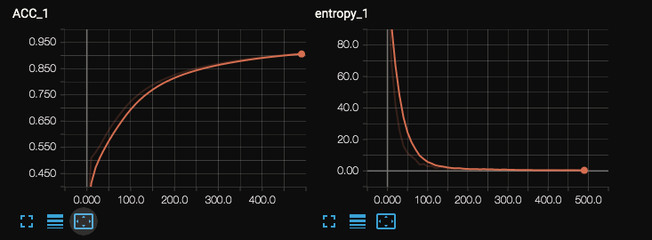

# LANE DETECTION 
This is a light weight Tensorflow implementation of lane detection using fully connected convolutional (FCN) network.


A Demo Picture

This is a forked work from [link](https://github.com/shekkizh/FCN.tensorflow). 
The implementation is largely based on the reference code provided by the authors of the paper [link](https://github.com/shelhamer/fcn.berkeleyvision.org). 

## Hightlighted Work
 - Take input images of any size.
 - Tailored model for performance: 20 layers lighter than pretrained model. 86% less parameter memory.

## Prerequisites
 - The code was written and tested with `tensorflow0.14` and `python2.7`. 
 - Dataset is using [KITTI Vision Benchmark Suite](http://www.cvlibs.net/datasets/kitti/eval_road.php). Download the training data in `Data_zoo/kitti_road/`
 - Used pretrained model of [IMAGENET VGG 19](http://www.vlfeat.org/matconvnet/models/beta16/imagenet-vgg-verydeep-19.mat)

## Run

To train:
```shell
python FCN.py --batch_size=5 --learning_rate=1e-5
```

To evaluate on a random batch in validation set:
```shell
python FCN.py --batch_size=5 --mode=visualize
```

To infer a image:
``` shell
python FCN.py --batch_size=5 --mode=infer --data_dir=<image directory or path>
```

- `debug` flag can be set during training to add information regarding activations, gradients, variables etc.
-  Use [IPython notebook](https://github.com/shekkizh/FCN.tensorflow/blob/master/logs/Image_Cmaped.ipynb) can be to view results.


## Results
After 1000 batches (~200 epochs), on validation set gets:

ACC (pixcel accuracy): 0.963042, mIOU: 0.797466, time: 5 images / 1.8s

Here's the training curves:


## Next Works
- Post processing the predicted images. Consider use CRF.
- KITTI dataset is limited (300 images for train). More data is required to learn rich & generalized features and take care of more scene type. Consider use [tusimple](http://benchmark.tusimple.ai/#/t/1/dataset) or [synthia](http://synthia-dataset.net/).
- Benchmark on public dataset.

## Others
- Implementation Paper: [Fully Convolutional Networks for Semantic Segmentation](http://arxiv.org/pdf/1605.06211v1.pdf) (FCNs). 
- Video of the presentaion given by the authors on the paper - [link](http://techtalks.tv/talks/fully-convolutional-networks-for-semantic-segmentation/61606/)
- The model is originally applied on the Scene Parsing Challenge dataset provided by MIT [http://sceneparsing.csail.mit.edu/](http://sceneparsing.csail.mit.edu/). Take a look at the code to switch dataset.
